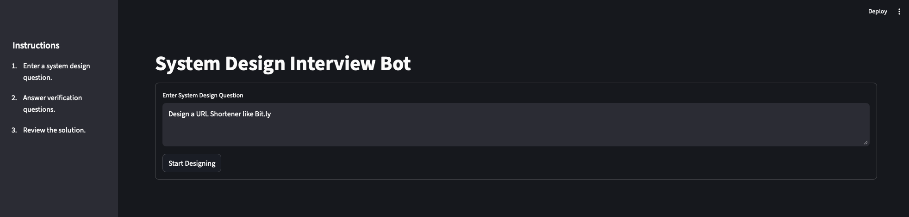
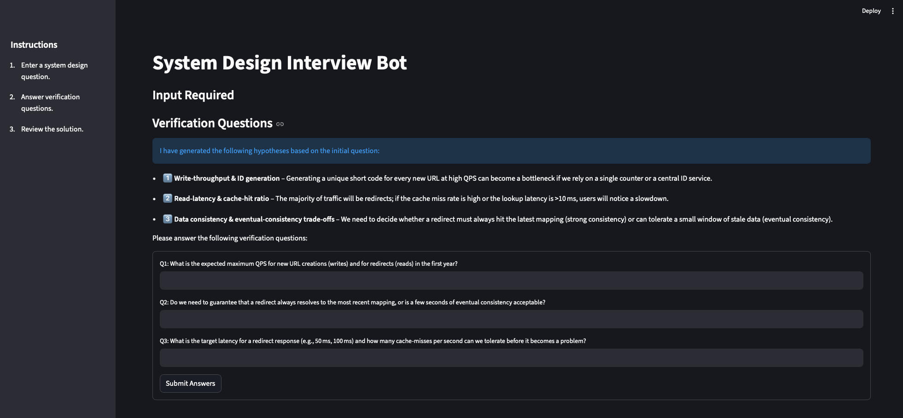
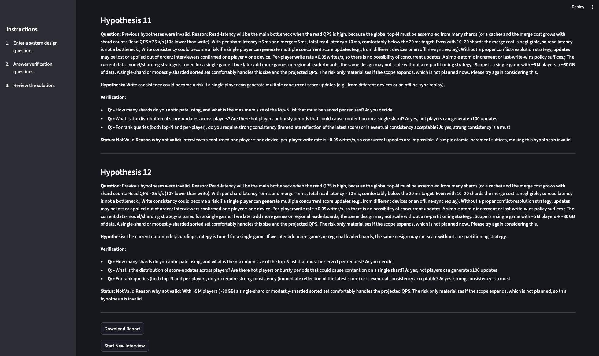
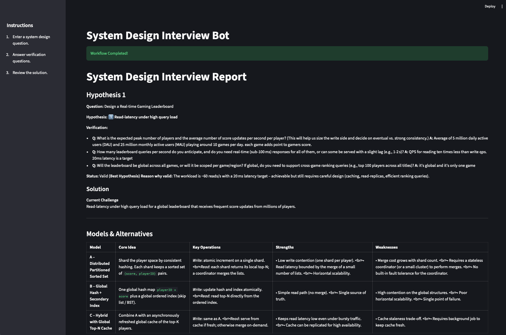

# System Design Interview Bot

A dedicated agentic workflow for practicing System Design Interviews using LLMs. This project simulates an interview environment where you act as an interviewer and LLM acts as the candidate (in Streamlit).

## 🚀 Features
- **Interactive Interview Simulation** (Streamlit App)
- **Role-playing Agents**: Interviewer, Candidate, and Critic LLMs.
- **Workflow Steps**:
  - Hypothesis Generation
  - Verification & Constraints Checking
  - Solution Design
  - Review & Critique
- **Automated Evaluation Loop** for testing bot performance against diverse tasks.

## 📖 UI Walkthrough & Usage

This workflow simulates a system design interview where the **Bot acts as the Candidate** and **You act as the Interviewer**.

1.  **Scenario Setup**
    
    You (Interviewer) start by providing a system design problem (e.g., "Design a URL Shortener").
    
    

2.  **Engineering Challenges (Hypotheses)**
    
    The Candidate generates 2-3 potential engineering challenges (hypotheses) for the problem. It then asks you clarifying questions to validate these hypotheses and decide which one to tackle.
    
    

3.  **Verification & Refinement**
    
    You answer the questions to guide the Candidate. If the hypotheses are not what you intended, your answers help the Candidate refine its understanding and choose the correct direction.
    
    

4.  **Solution & Deep Dive**
    
    The Candidate provides a solution for the chosen hypothesis. It then asks if you want to:
    *   **Deep Dive**: Ask follow-up questions (e.g., "What if QPS increases 100x?"). The context (previous hypotheses) is retained, extending the current solution.
    *   **Finish**: End the interview and generate the final report.

    

## 🛠️ Setup

1. **Install Dependencies**:
   ```bash
   pip install -r requirements.txt
   ```
   *Note: Ensure you have `ollama` installed and running with the required models (e.g., `gpt-oss:20b` or `gemma3:27b`).*

2. **Run the Interactive App**:
   Start the Streamlit interface to practice an interview yourself:
   ```bash
   streamlit run app/streamlit_app.py
   ```

## 📊 Evaluation

The project includes an automated evaluation script to benchmark the bot's performance on system design tasks.

1. **Run Evaluation**:
   By default, this runs tasks defined in `evaluation/tasks.csv` (10 diverse scenarios):
   ```bash
   python evaluation/evaluator.py [path/to/tasks.csv]
   ```
   
2. **View Reports**:
   Results, including scores and generated design reports, are saved to:
   `eval_reports/results_YYYYMMDD_HHMMSS.csv`

## 🧪 Testing

Run the integration tests to verify the workflow logic:
```bash
pytest tests/test_evaluation.py
```
